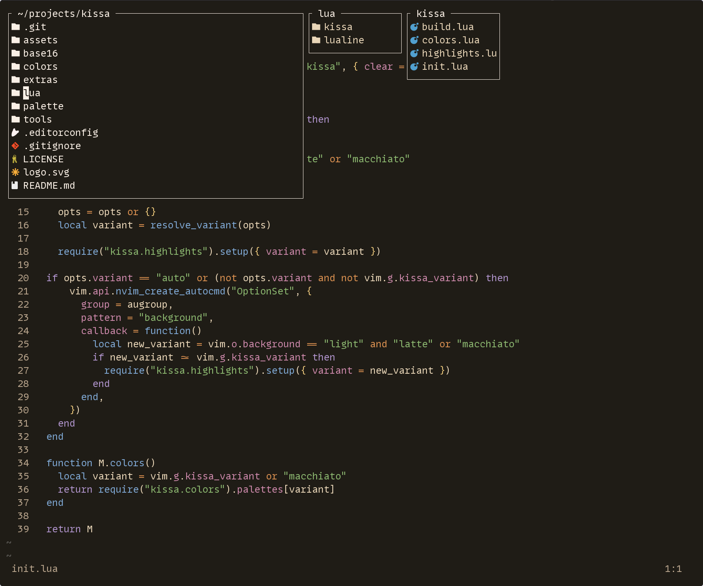
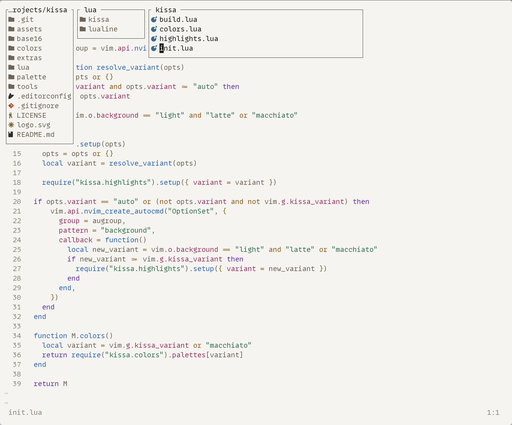

# 　喫茶　· /kissa/ · "KEE-sah"
WCAG AA+ accessible color schemes rooted in espresso.

<div align="center">
   
</div>

## Quick Start

### Neovim

Using [lazy.nvim](https://github.com/folke/lazy.nvim):

```lua
{
  "rwendell/kissa",
  lazy = false,
  priority = 1000,
  config = function()
    require("kissa").setup({ variant = "auto" })
  end,
}
```

## Palette

| Color | Macchiato | Latte | Usage |
|-------|-----------|-------|-------|
| `bg` |  |  | Background |
| `bg_alt` |  |  | Statusline, gutters |
| `surface0` |  |  | Selection, panels |
| `surface1` |  |  | Cursor line, folds |
| `surface2` |  |  | Dim surfaces |
| `fg` |  |  | Primary text |
| `fg_dim` |  |  | Secondary text |
| `fg_muted` |  |  | Tertiary text |
| `fg_subtle` |  |  | Comments |
| `red` |  |  | Errors, deletes |
| `orange` |  |  | Operators, numbers |
| `yellow` |  |  | Strings, warnings |
| `green` |  |  | Functions, diff-add |
| `teal` |  |  | Types, regex |
| `blue` |  |  | Keywords, links |
| `purple` |  |  | Constants |
| `pink` |  |  | Properties |

## Ports

| Format | Path |
|--------|------|
| Neovim | [`colors/`](colors/) |
| Ghostty | [`extras/ghostty/`](extras/ghostty/) |
| Kitty | [`extras/kitty/`](extras/kitty/) |
| Alacritty | [`extras/alacritty/`](extras/alacritty/) |
| WezTerm | [`extras/wezterm/`](extras/wezterm/) |
| Foot | [`extras/foot/`](extras/foot/) |
| iTerm2 | [`extras/iterm2/`](extras/iterm2/) |
| XResources | [`extras/xresources/`](extras/xresources/) |
| OpenCode | [`extras/opencode/`](extras/opencode/) |
| Base16 | [`base16/`](base16/) |
| Palette TOML | [`palette/`](palette/) |


## Etymology

**Kissa** (喫茶) is Japanese for "coffee house" — specifically the *kissaten* (喫茶店), the quiet, craft-focused coffee shops that predate speciality cafes. 喫 (ki) means "to drink/savor" and 茶 (sa) means "tea" — though in practice it means the place where coffee is served with intention.
